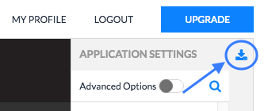

# 
[gulp](https://github.com/wearefractal/gulp)-jscrambler
--------------------

Add obfuscation to your build process with [gulp](https://github.com/wearefractal/gulp) and gulp-jscrambler.

> DISCLAIMER: If you are looking for Jscrambler 3.8 or below please go to [this page](https://github.com/jscrambler/gulp-jscrambler/tree/v0).

## How to Use

### Install

Install with [npm](https://npmjs.org/package/gulp-jscrambler).

```
npm install -D gulp-jscrambler
```
Option `-D` will make sure it is installed as a `devDependency`.

### Setup your Jscrambler Gulp task

In order to start using gulp-jscrambler you will need to add a new task to your project `gulpfile.js`. This task will be responsible for protecting your application with Jscrambler.

Here's an example of how Jscrambler task should look like:

```js
var gulp = require('gulp');
var jScrambler = require('gulp-jscrambler');

gulp.task('default', function () {
  gulp
    .src('app/**/*.js')
    .pipe(jScrambler({
      keys: {
        accessKey: 'XXXXXXXXXXXXXXXXXXXXXXXXXXXXXXXXXXXXXXXX',
        secretKey: 'XXXXXXXXXXXXXXXXXXXXXXXXXXXXXXXXXXXXXXXX'
      },
      applicationId: 'XXXXXXXXXXXX',
      params: [
        {
          name: 'whitespaceRemoval'
        },
        {
          name: 'charToTernaryOperator'
        }
      ]
    }))
    .pipe(gulp.dest('dist/'));
});
```

You will need your credentials and Application ID in order to protect your application.
Navigate to your [profile](https://app.jscrambler.com/profile) page and grab your `accessKey` and `secretKey` at the _API Credentials_ section.

Your `applicationId` can be found inside your application page just below your application name. Click the copy to clipboard icon to copy the `applicationId`.


You can also grab your current configuration on your application page. This will download a `.json` file containing a valid configuration with your currently selected options.



Keep in mind that the `params` object is optional and if it is not provided we will use your previous configuration.

### Usage Example

You can find some working examples [here](https://github.com/jscrambler/grunt-jscrambler/tree/master/examples)
